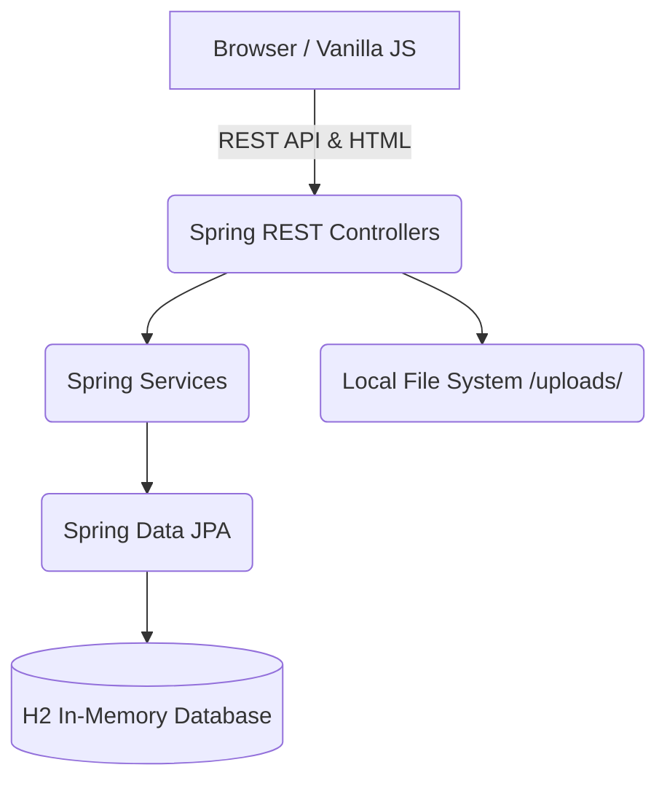
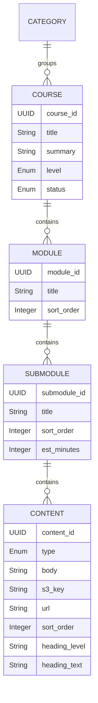

# System Architecture & Data Model

## High-Level Architecture
The application is a monolith written in Spring Boot. It uses a Controller-Service-Repository pattern.

## Data Model (Entity Hierarchy)

The core domain model focuses on course authoring and content structure. 

### Content Blocks (`Content.java`)
The `Content` entity represents the fundamental building block of a lesson (Submodule). A content block has a specific `type` enum (e.g., `TEXT`, `HEADING`, `QUOTE`, `CODE`, `IMAGE`, `VIDEO`, `PDF`). Depending on the type, different fields are populated.
- For textual content, the `body` field stores Markdown strings.
- For media content, `url` and `s3_key` store the locations of the uploaded files.

## Local Storage Integration
The application supports both direct-to-S3 uploads and local storage fallbacks. 
- **Upload Controller:** `LocalUploadController` writes `MultipartFile` payloads directly to the `./uploads/` directory on the server.
- **Serving Files:** `WebConfig` registers a `ResourceHandler` to statically serve files from the `./uploads/` directory to the `/uploads/**` path on the frontend.
